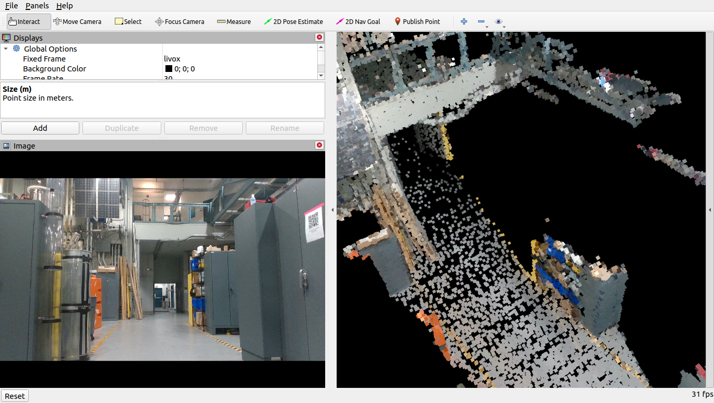
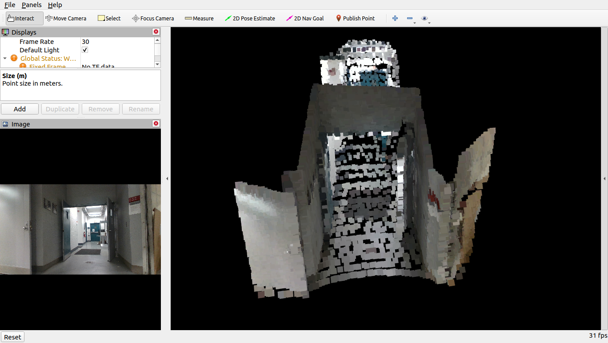
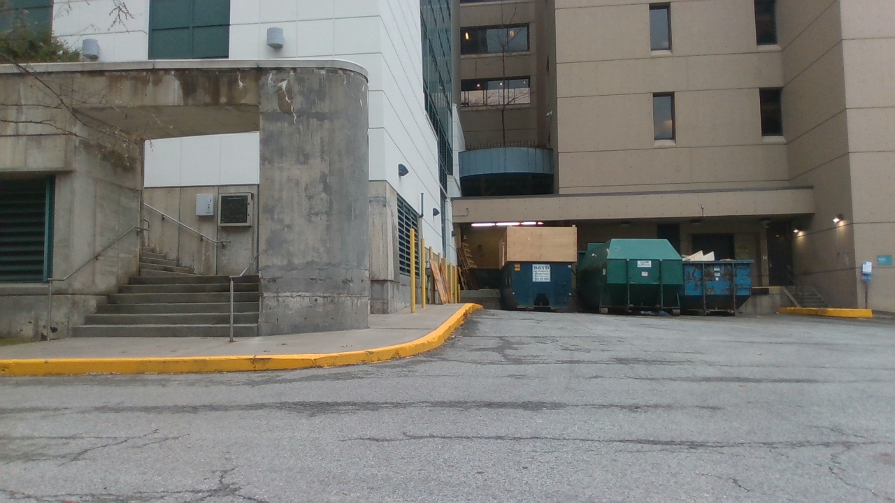
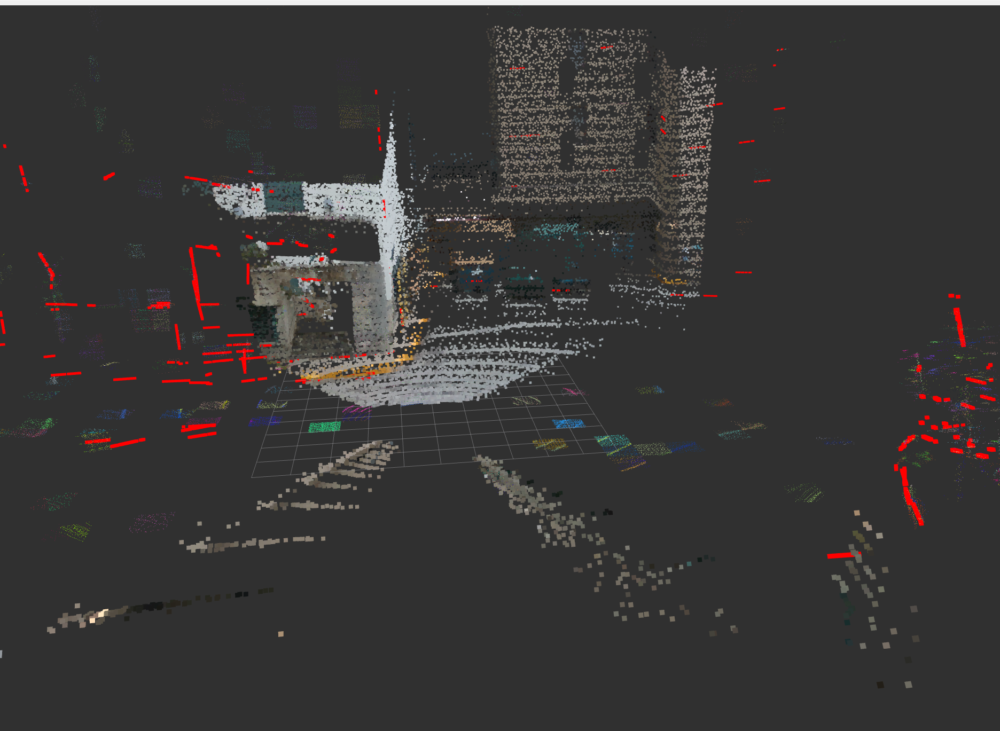

# lidar_camera_calib
**lidar_camera_calib** is a tool that extends [Pixel-level Extrinsic Self Calibration of High Resolution LiDAR and Camera in Targetless Environments](https://github.com/hku-mars/livox_camera_calib) to spinning LiDARs (e.g.  Velodyne, Ouster). 

The original tool is a robust, high accuracy extrinsic calibration tool LiDAR-camera calibration in a targetless environment. The algorithm can run in both indoor and outdoor settings, and only requires edge information in the scene. If the scene is suitable, we can achieve pixel-level accuracy similar to or even beyond the target based method.
<div align="center">
    
    <font color=#a0a0a0 size=2>An example of a outdoor calibration scenario. We color the point cloud with the calibrated extrinsic and compare with actual image. A and C are locally enlarged
views of the point cloud. B and D are parts of the camera image
corresponding to point cloud in A and C.</font>
</div>

## Key features:
1. Extends an automatic targetless extrinsic calibration tool for LiDAR-Camera Calibration to spinning LiDARs as well. It has been tested in both indoor and outdoor environments and algorithm is able to converge and have good accuracy.
2. Supports ROS2 (has been tested with ROS2 Humble).

## Results:
### Indoor results:
<div align="center">
    
    <font color=#a0a0a0 size=2>Coloured pointcloud after calibration of a portion of a corridor of the Field Robotics Center
</font>
</div>
<div align="center">
    
    <font color=#a0a0a0 size=2>Coloured pointcloud after calibration of a closed hallway
</font>
</div>

### Outdoor results:
<div align="center">
    
    
    <font color=#a0a0a0 size=2>Coloured pointcloud after calibration outside Newell-Simon Hall
</font>
</div>

## 1. Prerequisites
### 1.1 **Ubuntu** and **ROS2**
Ubuntu 64-bit 22.04.
ROS2 Humble and additional ROS package:

```
    sudo apt-get install ros-XXX-cv-bridge ros-xxx-pcl-conversions
```
```
    rosdep install --from-paths ./src --ignore-packages-from-source --rosdistro humble -y
```

### 1.2 **Eigen**
Follow [Eigen Installation](http://eigen.tuxfamily.org/index.php?title=Main_Page)

### 1.3 **Ceres Solver**
Follow [Ceres Installation](http://ceres-solver.org/installation.html).

### 1.4 **PCL**
Follow [PCL Installation](http://www.pointclouds.org/downloads/linux.html). (Our code is tested with PCL1.12)

## 2. Usage:
1. Record a ROS2 bag file while moving the LiDAR-camera setup. During our testing, we tried both lateral translation and pitching motion and both yielded good convergence, although pitching will give you a denser pointcloud.
2. Clone, build and run [lidarslam_ros2](https://github.com/rsasaki0109/lidarslam_ros2) on this bag file and generate a PCD file. You can apply this [patch](https://drive.google.com/file/d/1uWbe-g_dBGQJfqEkAjVM40b2VoxyBo4W/view?usp=share_link) to run with our example bag files.
3. Extract the first image from the recorded camera data in this bag file and save it. You can use the given extract_image_from_bag.py script for this.
4. Modify the **calib.yaml**, change the data path to your local data path and provide the instrinsic matrix and distor coeffs for your camera.
Run the package as
```
    ros2 launch lidar_camera_calib calib.launch.py
```

## 3. Example data
You can find ROS2 bags and PCD and image files that we have collected [here](https://drive.google.com/drive/folders/10K7a8jBlQauFhM2RSi9Z-lS_SNg3O_4p?usp=sharing)